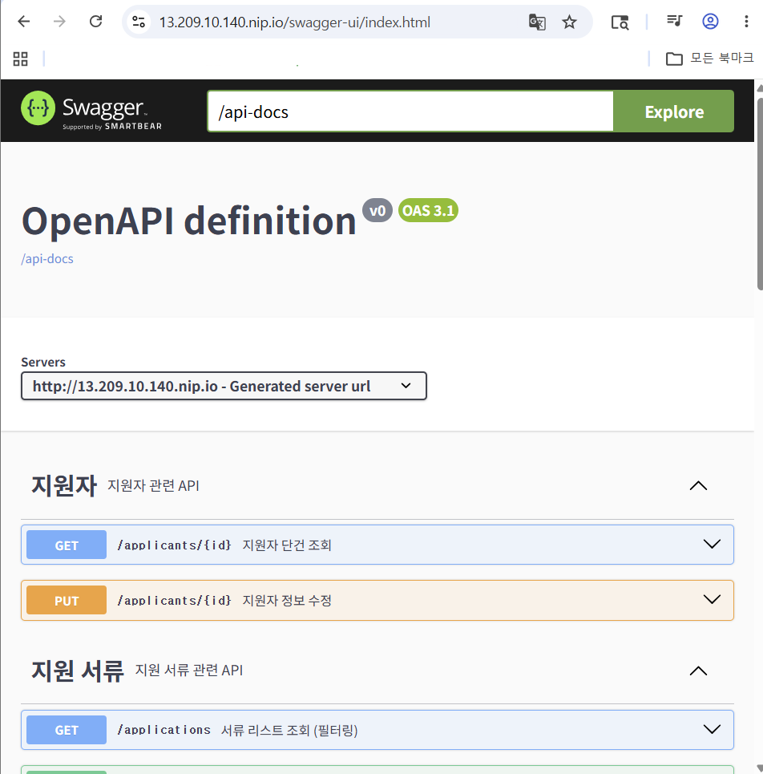
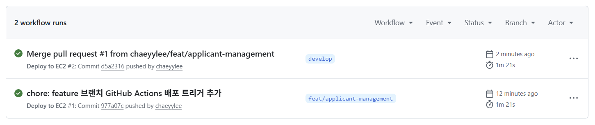
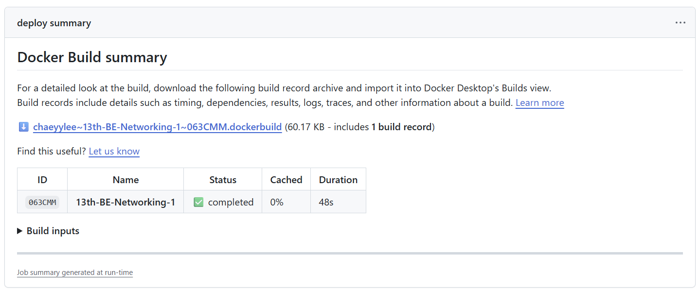

# 배포 과제 문서

## 1. 아키텍처 다이어그램

### 사용자 요청 흐름

```text
사용자
  ↓
https://13.209.10.140.nip.io
  ↓
.nip.io 도메인
  ↓
Nginx Reverse Proxy (80 / 443)
  ↓
Spring Boot Docker Container (8080)
  ↓
MySQL Docker Container (3306)
  ↓
Docker Volume
```

### 자동 배포 흐름

```text
GitHub Repository
  ↓ push
GitHub Actions
  ↓
Docker Image Build
  ↓
Docker Hub Push
  ↓
EC2 Server Pull
  ↓
Docker Compose
  ↓
Spring Boot Container 교체 및 재실행
```

### 전체 구조

```text
사용자
  ↓
https://13.209.10.140.nip.io
  ↓
Nginx (80 / 443)
  ↓
Spring Boot Container (8080)
  ↓
MySQL Container (3306)

GitHub Actions
  ↓
Docker Hub: chaeyylee/cotato-backend:latest
  ↓
EC2 Docker Compose 배포
```

### 이미지 배포 방식

이번 과제에서는 아래 방식으로 배포를 진행하였다.

```text
로컬 환경에서 Docker 이미지 빌드
  ↓
Docker Hub에 이미지 push
  ↓
EC2 서버에서 docker-compose를 통해 이미지 pull
  ↓
컨테이너 실행 및 배포
```

Docker Hub에 업로드한 이미지:

```text
chaeyylee/cotato-backend:latest
```

GitHub Actions를 통해 push 발생 시 자동으로 다음 과정이 수행되도록 구성하였다.

```text
Docker 이미지 빌드
  ↓
Docker Hub push
  ↓
EC2 서버 SSH 접속
  ↓
docker-compose pull app
  ↓
docker-compose up -d
```

---

## 2. 배포 URL

### 배포 URL

```text
https://13.209.10.140.nip.io
```

### Swagger 접속 URL

```text
https://13.209.10.140.nip.io/swagger-ui/index.html
```

---

## 3. 배포된 Swagger 접속 화면 캡처

배포된 서버에서 Swagger가 정상적으로 접속되는 것을 확인하였다.



---

## 4. GitHub Actions 성공 화면 캡처

GitHub Actions 자동 배포 Workflow가 정상적으로 성공한 것을 확인하였다.

Workflow 이름:

```text
Deploy to EC2
```

확인 내용:

```text
GitHub Actions 실행 성공
Docker 이미지 빌드 성공
Docker Hub push 성공
EC2 SSH 접속 성공
EC2 서버에서 docker-compose pull 및 up 실행 성공
```




---

## 5. Dockerfile / Nginx 설정 내용

### Dockerfile

이번 배포에서는 로컬 및 GitHub Actions 환경에서 Docker 이미지를 빌드하고, EC2 서버에서는 Docker Hub에 push된 이미지를 pull하여 실행하는 방식을 사용하였다.

```dockerfile
FROM eclipse-temurin:21-jre

WORKDIR /app

COPY build/libs/*.jar app.jar

EXPOSE 8080

ENTRYPOINT ["java", "-Dspring.profiles.active=prod", "-jar", "app.jar"]
```

### docker-compose.yml

EC2 서버에서는 Docker Compose를 사용하여 Spring Boot 컨테이너와 MySQL 컨테이너를 함께 실행하였다.

```yml
services:
  db:
    image: mysql:8.0
    container_name: cotato-db
    environment:
      MYSQL_ROOT_PASSWORD: ${MYSQL_ROOT_PASSWORD}
      MYSQL_DATABASE: ${MYSQL_DATABASE}
      MYSQL_USER: ${MYSQL_USER}
      MYSQL_PASSWORD: ${MYSQL_PASSWORD}
    volumes:
      - mysql-data:/var/lib/mysql
    healthcheck:
      test: ["CMD", "mysqladmin", "ping", "-h", "localhost"]
      interval: 10s
      timeout: 5s
      retries: 5
    restart: unless-stopped

  app:
    image: chaeyylee/cotato-backend:latest
    container_name: cotato-app
    environment:
      DB_URL: jdbc:mysql://db:3306/${MYSQL_DATABASE}?useSSL=false&serverTimezone=Asia/Seoul&allowPublicKeyRetrieval=true
      DB_USERNAME: ${MYSQL_USER}
      DB_PASSWORD: ${MYSQL_PASSWORD}
    ports:
      - "8080:8080"
    depends_on:
      db:
        condition: service_healthy
    restart: unless-stopped

volumes:
  mysql-data:
```

민감 정보는 `.env` 파일과 GitHub Secrets로 분리하여 관리하였다.

### Nginx 설정

Nginx 설정 파일 경로:

```text
/etc/nginx/sites-available/cotato
```

처음 리버스 프록시 설정은 아래와 같이 작성하였다.

```nginx
server {
    listen 80;
    server_name 13.209.10.140.nip.io;

    location / {
        proxy_pass http://127.0.0.1:8080;
        proxy_set_header Host $host;
        proxy_set_header X-Real-IP $remote_addr;
        proxy_set_header X-Forwarded-For $proxy_add_x_forwarded_for;
        proxy_set_header X-Forwarded-Proto $scheme;
    }
}
```

설정 파일을 생성한 뒤 아래 명령어로 적용하였다.

```bash
sudo ln -s /etc/nginx/sites-available/cotato /etc/nginx/sites-enabled/
sudo rm /etc/nginx/sites-enabled/default
sudo nginx -t
sudo systemctl reload nginx
```

`sudo nginx -t` 실행 결과 아래와 같이 설정 파일이 정상임을 확인하였다.

```text
nginx: the configuration file /etc/nginx/nginx.conf syntax is ok
nginx: configuration file /etc/nginx/nginx.conf test is successful
```

이후 Certbot을 사용하여 HTTPS 인증서를 발급하였다.

```bash
sudo apt install -y certbot python3-certbot-nginx
sudo certbot --nginx -d 13.209.10.140.nip.io
```

인증서 발급 후 Certbot이 Nginx 설정에 SSL 관련 내용을 자동으로 반영하였고, 최종적으로 swagger를 통해 HTTPS 접속을 확인하였다.


---

## 6. 트러블슈팅 노트

### 문제 1. Docker 실행 시 MySQL 3306 포트 충돌 발생

문제: 로컬 Docker 환경에서 MySQL 컨테이너를 실행할 때 3306 포트 충돌이 발생하였다.

원인: 로컬 PC에서 이미 MySQL 또는 다른 프로세스가 3306 포트를 사용하고 있었다.

해결: docker-compose.yml에서 호스트 포트를 3307로 변경하였다. 컨테이너 내부에서는 MySQL 기본 포트인 3306을 그대로 사용하고, 외부에서 접근하는 호스트 포트만 3307로 매핑하였다.

수정 내용:

```yml
ports:
  - "3307:3306"
```

---

### 문제 2. MySQL 컨테이너에서 MYSQL_USER=root 오류 발생

문제: MySQL 컨테이너 실행 중 `MYSQL_USER=root`를 사용할 수 없다는 오류가 발생하였다.

원인: `MYSQL_USER`는 일반 사용자 계정을 생성하기 위한 환경변수인데, root 계정은 `MYSQL_ROOT_PASSWORD`로 관리해야 한다.

해결: root 계정 비밀번호는 `MYSQL_ROOT_PASSWORD`로 설정하고, Spring Boot 애플리케이션 접속용 일반 계정은 별도로 생성하였다.

---

### 문제 3. EC2 t3.micro 환경에서 Docker 빌드 및 Spring Boot 실행이 느려짐

문제: EC2 t3.micro 인스턴스에서 Docker 이미지 빌드와 Spring Boot 실행이 매우 느리거나 SSH 입력이 지연되는 문제가 발생하였다.

원인: t3.micro는 메모리가 1GB라서 MySQL, Spring Boot, Docker 빌드 과정을 동시에 수행하기에 자원이 부족하였다.

해결: 더 안정적인 실행을 위해 t3.small 인스턴스를 사용하였다. 또한 EC2 서버에서 직접 이미지를 빌드하지 않고, Docker Hub에 push된 이미지를 EC2에서 pull하는 방식으로 변경하였다.

---

### 문제 4. Spring Boot 컨테이너가 MySQL에 연결하지 못함

문제: Spring Boot 컨테이너 실행 시 MySQL 연결 실패가 발생하였다.

원인: 컨테이너 내부에서 localhost는 EC2 서버나 다른 컨테이너가 아니라 자기 자신을 의미한다. 따라서 Spring Boot 컨테이너에서 localhost:3306으로 접근하면 MySQL 컨테이너에 연결할 수 없다.

해결: Docker Compose 네트워크에서 MySQL 서비스 이름인 db를 DB host로 사용하였다.

수정 내용:

```yml
DB_URL: jdbc:mysql://db:3306/${MYSQL_DATABASE}?useSSL=false&serverTimezone=Asia/Seoul&allowPublicKeyRetrieval=true
```

---

### 문제 5. EC2에서 Swagger가 외부에서 접속되지 않음

문제: EC2에서 Spring Boot 컨테이너는 실행 중이었지만 외부 브라우저에서 Swagger 접속이 되지 않았다.

원인: 보안 그룹 인바운드 규칙에 8080 포트가 열려 있지 않았거나, 초기 설정에서 포트 번호를 잘못 입력하였다.

해결: 초기 확인을 위해 보안 그룹에 8080 포트를 임시로 허용하였다. 이후 Nginx와 HTTPS 설정을 완료한 뒤에는 8080 포트를 닫고, 80/443 포트를 통해 접속되도록 구성하였다.

---

### 문제 6. Ubuntu 26.04에서 Docker Compose 설치 및 SSH 접속 문제가 발생함

문제: Ubuntu 26.04 기반 EC2 인스턴스에서 docker-compose-plugin 패키지를 찾지 못하거나, SSH 및 EC2 Instance Connect가 불안정하게 동작하였다.

원인: 과제 자료와 Docker/Nginx 관련 예제가 대부분 Ubuntu 22.04 또는 24.04 LTS 기준으로 작성되어 있었고, Ubuntu 26.04 환경에서는 일부 패키지와 도구 사용이 원활하지 않았다.

해결: Ubuntu 24.04 LTS 기반 인스턴스를 새로 생성하여 진행하였다. Docker Compose는 공식 GitHub Release 바이너리를 직접 다운로드하여 설치하였다.

설치 명령어:

```bash
sudo curl -L "https://github.com/docker/compose/releases/download/v2.27.0/docker-compose-linux-x86_64" -o /usr/local/bin/docker-compose
sudo chmod +x /usr/local/bin/docker-compose
docker-compose --version
```

---

### 문제 7. GitHub Actions가 feature 브랜치 push에서 실행되지 않음

문제: GitHub Actions workflow 파일을 push했지만 Actions 탭에서 자동 배포가 실행되지 않았다.

원인: workflow 트리거 브랜치에 현재 작업 브랜치인 feat/applicant-management가 포함되어 있지 않았다.

해결: deploy.yml의 push 대상 브랜치에 feat/applicant-management를 추가하였다. 최종적으로 main, develop, feat/applicant-management 브랜치 push 시 workflow가 실행되도록 설정하였다.

수정 내용:

```yml
on:
  push:
    branches:
      - main
      - develop
      - feat/applicant-management
```

---

### 문제 8. Docker 권한 문제로 docker-compose 실행 실패

문제: EC2에서 docker-compose up -d 실행 시 Docker daemon socket에 접근할 수 없다는 permission denied 오류가 발생하였다.

원인: ubuntu 사용자가 docker 그룹에 포함되지 않았거나, 그룹 권한 변경 후 재접속하지 않아 권한이 반영되지 않았다.

해결: ubuntu 사용자를 docker 그룹에 추가한 뒤 SSH 세션을 종료하고 다시 접속하였다.

해결 명령어:

```bash
sudo usermod -aG docker ubuntu
exit
```

재접속 후 다시 실행:

```bash
docker-compose up -d
```

---

## 최종 확인

로컬 Docker 환경에서 컨테이너 실행 상태를 확인하였다.

```bash
docker compose up -d --build
docker ps
```

실행 결과:

```text
✔ Network cotato_default Created
✔ Volume "cotato_mysql-data" Created
✔ Container cotato-db Healthy
✔ Container cotato-app Started
```

추가로 `docker ps`를 통해 Spring Boot 컨테이너와 MySQL 컨테이너가 정상 실행 중임을 확인하였다.

```text
CONTAINER ID   IMAGE                      STATUS                    PORTS                                         NAMES
2046b97f203c   13th-be-networking-1-app   Up 3 seconds              0.0.0.0:8080->8080/tcp                        cotato-app
80b0a3b6da48   mysql:8.0                  Up 24 seconds (healthy)   0.0.0.0:3307->3306/tcp                        cotato-db
```

EC2 서버에서도 Docker Compose를 통해 컨테이너 실행 상태를 확인하였다.

```text
✔ Network cotato_default Created
✔ Volume "cotato_mysql-data" Created
✔ Container cotato-db Healthy
✔ Container cotato-app Started
```

Spring Boot 로그를 통해 애플리케이션이 정상 실행되었음을 확인하였다.

```bash
docker logs cotato-app --tail 30
```

확인 로그:

```text
The following 1 profile is active: "prod"
Tomcat initialized with port 8080 (http)
HikariPool-1 - Start completed.
Tomcat started on port 8080 (http) with context path '/'
Started BackendApplication
```

MySQL 연결 또한 정상적으로 완료된 것을 확인하였다.

```text
HikariPool-1 - Added connection com.mysql.cj.jdbc.ConnectionImpl
Initialized JPA EntityManagerFactory for persistence unit 'default'
```

Nginx 및 HTTPS 설정 완료 후 `.nip.io` 도메인에서 Swagger 접속을 확인하였다.

```text
https://13.209.10.140.nip.io/swagger-ui/index.html
```

GitHub Actions 자동 배포 또한 정상적으로 성공한 것을 확인하였다.

```text
Deploy to EC2 workflow completed successfully
Docker 이미지 빌드 성공
Docker Hub push 성공
EC2 자동 배포 성공
```